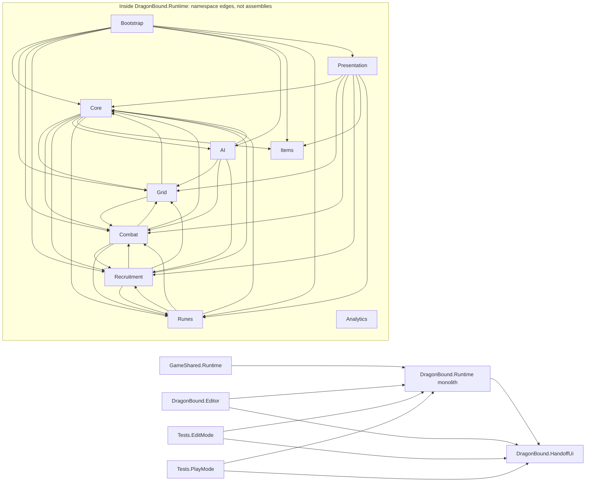
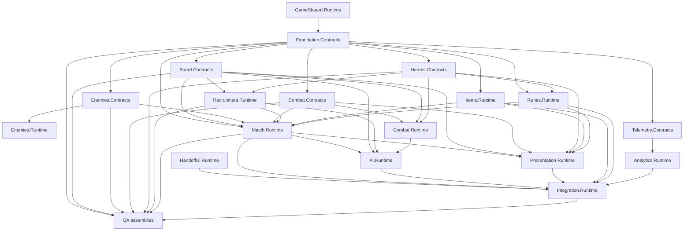

# Module Dependency Graph V1

## Current graph

The graph is inferred from actual `using DragonBound.*` references and constructor calls in the current `DragonBound.Runtime` assembly.

## Target DAG

## DAG constraints

- Contracts contain no concrete reference to a higher layer and no Scene/Prefab dependency.
- Match owns orchestration, not AI policy, UI, or persistence authority.
- Combat consumes modifier ports; it does not reference Rune or Item implementations.
- Items and Runes consume Match/Combat contracts through ports and never reference Presentation.
- Presentation consumes immutable snapshots and emits commands; Integration wires commands to services.
- Analytics consumes telemetry contracts; gameplay does not depend on analytics sinks.
- Integration is the only assembly allowed to reference every runtime module and serialized product asset.
